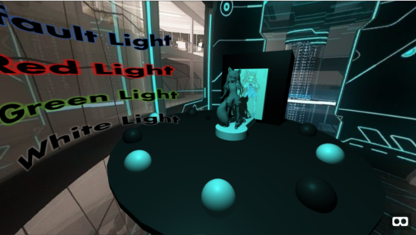

# Waifu-Factory

credits: 
Robot Love by Klapex ft. GRETA

sci-fi hallway taken from - https://www.wallpaperup.com/58363/space_monitors_line_Staley_room_technology_sci-fi_science_computer_futuristic.html

I made the 3d model of the girl from scratch in blender using the image of the girl as the reference 
for the 3d model.

The artist who drew the piece was ocono who has since deactivated her deviantart account.

Hover over each of the Light labels to change the light color.

Hover over the center stage to make the spheres move to the center and move off the stage to make them return to their previous location.
